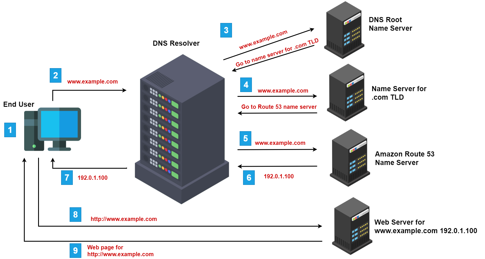

# 🛡️ Ethical Hacking Day 01: The Foundation of Reconnaissance & OSINT

**Investigator:** Mr. Rupesh Kumar  
**Project:** Information Gathering (Digital Footprinting)  
**Date:** April 2026 (Updated)

---

## 🌐 1. Fundamental Logic: Concepts of Connection

Bina basic concepts ke tools chalana "Script Kiddie" wala kaam hai. Ek hacker ko Domain aur IP ka gehra gyaan hona chahiye.

### **Domain vs IP Address (The Address Logic)**

- **Domain:** Ye website ka "Human-readable Name" hai (e.g., google.com). Iska kaam insaano ke liye yaad rakhna aasaan banana hai.
- **IP Address:** Ye machine ka asli "Unique ID" hai. Bina IP ke kisi server ko "hit" nahi kiya ja sakta. Hacker domain ko "Resolve" karke IP nikalta hai taaki server ki physical location aur network ka pata laga sake.

### **The Hacker Mindset: Weak Link Discovery**

- **Database Logic:** Hacker ko database ke andar nahi ghusna hota, use bas us "kamzor kadi" ko dhoondna hota hai jahan se chabi (Access) mil sake.
- **Technique:** SQL Injection (Data nikalna) ya Phishing (Admin ko dhoka dena).

---

## 🛠️ 2. Professional Toolset (Brief Explanation & Usage)

### 🆔 **WHOIS (The Identity Card)**

- **Kyun:** Kisi bhi website ke "Malik" ka pata lagane ke liye.
- **Deta Kya Hai:** Owner name, registration date, expiry date, aur Name Servers.
- **Usage:** `whois target.com`

### 🕵️ **SHERLOCK & WHATSMYNAME (Social Trackers)**

- **Kyun:** Agar aapko target ka sirf ek "Username" pata hai, toh ye use 500+ sites par dhoond nikalenge.
- **Deta Kya Hai:** Target ke Instagram, GitHub, Twitter aur baki profiles ke direct links.
- **Usage:** `python3 sherlock.py username`

### 📧 **HOLEHE (Email Validator)**

- **Kyun:** Ye check karne ke liye ki koi Email address kin-kin websites par register hai.
- **Deta Kya Hai:** Ye batata hai ki target Amazon, Twitter, ya Netflix use karta hai ya nahi.
- **Hacker Use:** Isse target ki personal life aur interest ka pata chalta hai.

### 🗺️ **GHUNT (The Google Specialist)**

- **Kyun:** Sirf ek Gmail ID se poori Google Profile scan karne ke liye.
- **Deta Kya Hai:** Google Photos, Maps activity, YouTube channel, aur profile name.
- **Usage:** `ghunt email target@gmail.com`

### 🔐 **LEAKCHECK (Data Breach Auditor)**

- **Kyun:** Ye dekhne ke liye ki kya target ka password kisi purane data breach mein chori hua hai.
- **Deta Kya Hai:** Leaked passwords aur plain-text emails.
- **Hacker Use:** Agar password purana hai, toh hacker seedha account mein "Login" kar sakta hai.

### 🏢 **MAMBAPANEL (Infrastucture Scout)**

- **Kyun:** Website ke piche ka backend setup dekhne ke liye.
- **Deta Kya Hai:** Default panels, open ports, aur server information.

### 🔎 **MR. HOLMES & HODSON (Frameworks)**

- **Kyun:** Alag-alag bikhri hui details (IP, Email, Username) ko ek jagah summarize karne ke liye.

osint.rocks

---

## ⚠️ 3. Installation & Troubleshooting (Day 01)

| Dikkat                  | Kyun Aati Hai?                                      | Solution                                                       |
| :---------------------- | :-------------------------------------------------- | :------------------------------------------------------------- |
| **Pip install failure** | Python version mismatch.                            | `python3 -m pip install -r requirements.txt` use karein.       |
| **API Key Missing**     | Tool ko premium data source ki permission nahi hai. | Tool ki official site par jaakar free API key generate karein. |
| **Timeout Error**       | Target site ne aapka IP block kiya hai.             | VPN ya Proxy ka use karein.                                    |

---

## 🧠 4. Investigator's Summary Checklist

- [ ] **WHOIS Scan:** Domain owner ki details nikali?
- [ ] **Social Footprint:** Sherlock se profiles mili?
- [ ] **Email Audit:** LeakCheck aur Holehe se login status dekha?
- [ ] **Infrastructure:** MambaPanel se server technology samjhi?

---

> **Pro-Tip:** "Ek achha hacker 90% time sirf research karta hai. Jitna zyada data, utna aasaan attack." 🚀🛡️
